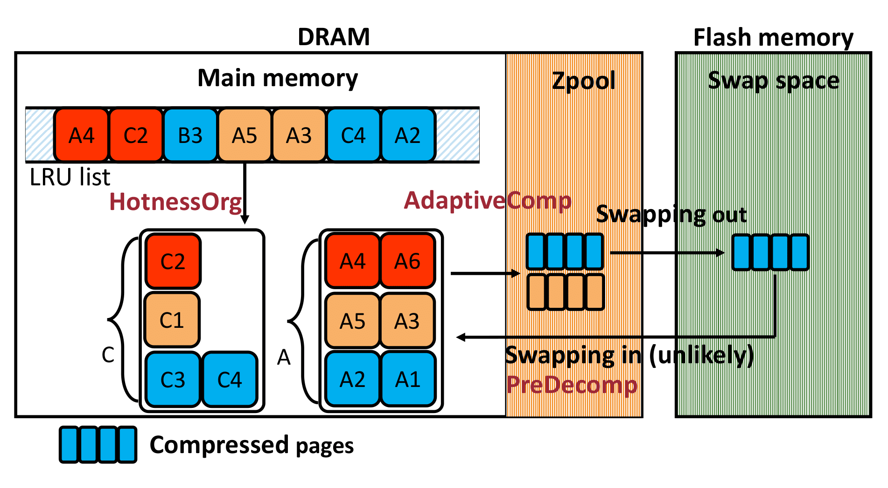

## Ariadne: A Hotness-Aware and Size-Adaptive Compressed Swap Technique for Fast Application Relaunch and Reduced CPU Usage on Mobile Devices

## Why do we need Ariadne?

As the memory demands of individual mobile applications continue to grow and the number of concurrently running applications increases, available memory on mobile devices is becoming increasingly scarce. When memory pressure is high, current mobile systems use a RAM-based compressed swap scheme (called ZRAM) to compress unused execution-related data (called anonymous data in Linux) in main memory. 

We observe that the state-of-the-art ZRAM scheme prolongs relaunch latency and wastes CPU time because it does not differentiate between hot and cold data or leverage different compression chunk sizes and data locality. We make three new observations. First, anonymous data has different levels of hotness. Hot data, used during application relaunch, is usually similar between consecutive relaunches. Second, when compressing the same amount of anonymous data, small-size compression is very fast, while large-size compression achieves a better compression ratio. Third, there is locality in data access during application relaunch.

Based on these observations, we propose a hotness-aware and size-adaptive compressed swap scheme, Ariadne, for mobile devices to mitigate relaunch latency and reduce CPU usage. Ariadne incorporates three key techniques.
First, a low-overhead hotness-aware data organization scheme aims to quickly identify the hotness of anonymous data without significant overhead.
Second, a size-adaptive compression scheme uses different compression chunk sizes based on the data's hotness level to ensure fast decompression of hot and warm data. 
Third, a proactive decompression scheme predicts the next set of data to be used and decompresses it in advance, reducing the impact of data swapping back into main memory during application relaunch.
 
We implement and evaluate Ariadne on a commercial smartphone, Google Pixel 7 with the latest Android 14.
Our experimental evaluation results show that, on average, Ariadne reduces application relaunch latency by 50% and decreases the CPU usage of compression and decompression procedures by 15% compared to the state-of-the-art compressed swap scheme for mobile devices.

## What is Ariadne?

Ariadne is a new compressed swap scheme for mobile devices that reduces application relaunch latency and CPU usage while increasing the number of live applications for enhanced user experience. The key idea of Ariadne is to reduce the frequency and latency of compression, decompression, swap-in, and swap-out operations by leveraging different compression chunk sizes based on the hotness level of the data, while also performing speculative decompression based on data locality characteristics.

<p align="center">
  
</p>

We use colors to represent the hotness levels of data pages: red for hot, orange for warm, and blue for cold data. In Android systems, anonymous data of running applications can be stored in main memory,  zpool, or flash memory-based swap space. Main memory has the lowest access latency, while flash memory-based swap space has the highest. Therefore, systems usually prioritize storing anonymous data in main memory for best performance. When main memory capacity is limited, systems use the ZRAM scheme to compress the least recently used LRU data into zpool. The flash memory-based swap space serves as main memory extension to store compressed data swapped out from  zpool when there is insufficient main memory space. Ariadne chooses to swap out compressed data, which leads to smaller writes to flash memory and lower storage space consumption.  However, this design choice may increase read latency due to decompression. We reduce the probability of incurring such latency by mainly writing cold data (that is unlikely to be read again) into the flash swap space. 

Based on the above data storage architecture, Ariadne incorporates three techniques: First, Ariadne uses a low-overhead, hotness-aware data organization mechanism, called HotnessOrg, to determine data hotness and maintain data with different levels of hotness in separate memory page lists accordingly. The goal of HotnessOrg is to reduce the frequency of compression/decompression and swap-in/swap-out operations. To achieve this goal, Ariadne aims to maintain uncompressed hot data in main memory, compress warm data into zpool, and swap compressed cold data to the flash memory-based swap space.
Second, Ariadne enables a size-adaptive compression mechanism, called AdaptiveComp, to leverage the benefits of different compression chunk sizes. The goal of AdaptiveComp is to achieve both short relaunch latency and a good compression ratio by using small-size compression chunks for identified warm data and large-size compression chunks for cold data. 
Third, rather than relying on on-demand decompression or data swapping-in operations during application relaunches, Ariadne employs a proactive and predictive decompression (i.e., predecompression) mechanism, called PreDecomp, that leverages data locality to proactively determine the best data and timing for compression and swapping. The goal of PreDecomp is to mitigate the negative impact of read latency on the user experience. 

## Citation
If you find this repo useful, please cite the following paper:
Yu Liang, Aofeng Shen, Chun Jason Xue, Riwei Pan, Haiyu Mao, Nika Mansouri Ghiasi, Qingcai Jiang, Rakesh Nadig, Lei Li, Rachata Ausavarungnirun, Mohammad Sadrosadati, Onur Mutlu, ["Ariadne: A Hotness-Aware and Size-Adaptive Compressed Swap Technique for Fast Application Relaunch and Reduced CPU Usage on Mobile Devices"](https://arxiv.org/abs/2502.12826), 2025 IEEE International Symposium on High-Performance Computer Architecture (HPCA), 2025.

```bibtex
@misc{liang2025ariadne,
      title={Ariadne: A Hotness-Aware and Size-Adaptive Compressed Swap Technique for Fast Application Relaunch and Reduced CPU Usage on Mobile Devices}, 
      author={Yu Liang and Aofeng Shen and Chun Jason Xue and Riwei Pan and Haiyu Mao and Nika Mansouri Ghiasi and Qingcai Jiang and Rakesh Nadig and Lei Li and Rachata Ausavarungnirun and Mohammad Sadrosadati and Onur Mutlu},
      year={2025},
      eprint={2502.12826},
      archivePrefix={arXiv},
      primaryClass={cs.OS},
      url={https://arxiv.org/abs/2502.12826}, 
}
```
## Table of Contents
  * [Why do we need Ariadne?](#Why-do-we-need-ariadne-)
  * [What is Ariadne?](#what-is-ariadne-)
  * [Citation](#citation)
  * [Prerequisites](#download-and-flash-kernel-for-Pixel-7)
  * [Collect Evaluation Results](#collect-evaluation-results)
  * [Contact](#contact)

# Download and flash kernel for Pixel 7

1. Download the Pixel 7 Pro's kernel source codes
```shell
mkdir /pixel7-kernel
cd /pixel7-kernel
repo init -u https://android.googlesource.com/kernel/manifest -b android-gs-pantah-5.10-android14
repo sync
```

2. Go to the directory of the source code, then input 
```shell
rm -rf /pixel7-kernel/android-kernel/out/android13-gs-pixel-5.10/dist/* # clear previous generated files
# cloudripper is another codename for pixel 7.
# Change it to correct one for your pixel
BUILD_CONFIG=private/gs-google/build.config.cloudripper build/build.sh
```

3. Compiled files are generated and stroed in `/pixel7-kernel/out/android13-gs-pixel-5.10/dist/`, then we can flash them into the kernel
```shell
cd /pixel7-kernel/android-kernel/out/android13-gs-pixel-5.10/dist/

adb reboot bootloader
fastboot oem disable-verification
# fastboot -w # this command will wipe the device, use it when needed

fastboot flash boot boot.img
fastboot flash dtbo dtbo.img
fastboot flash vendor_kernel_boot vendor_kernel_boot.img

fastboot reboot fastboot

fastboot flash vendor_dlkm vendor_dlkm.img
fastboot flash system_dlkm system_dlkm.img


fastboot reboot
```

3. When modifying the source code of the kernel, only the codes stored in `private/gs_google` directory will work after flashing you custom kernel. Otherwise, you modifcation won't work.

4. You can refer to code dir `gs_google` of this repo and make changes correctly to build the kernel which can collect and run the traces. We have already provided a smart phone with kernel built and flashed.


# Collect Evaluation Results
First of all, please go to dir contained traces.
```
cd AppTrace
```
## Coverage and Accuracy Results 

Run commands below to get our hot data prediction coverage and accuaray.
```
./get_cov_acc.sh
```
The result will be in ```cov_acc_result.txt``` inside AppTrace dir.

## Replay Trace

You can replay our collected trace on smart phone using
```
./replay_app_trace.sh
```
This will generate evaluaiton result which is collected on real smart phone.

## Extract Evaluation Results 
```
./get_eva_result.sh
```
The result will be in ```final_result.txt``` inside AppTrace dir.

## Contact

Yu Liang - yulianglenny@gmail.com
